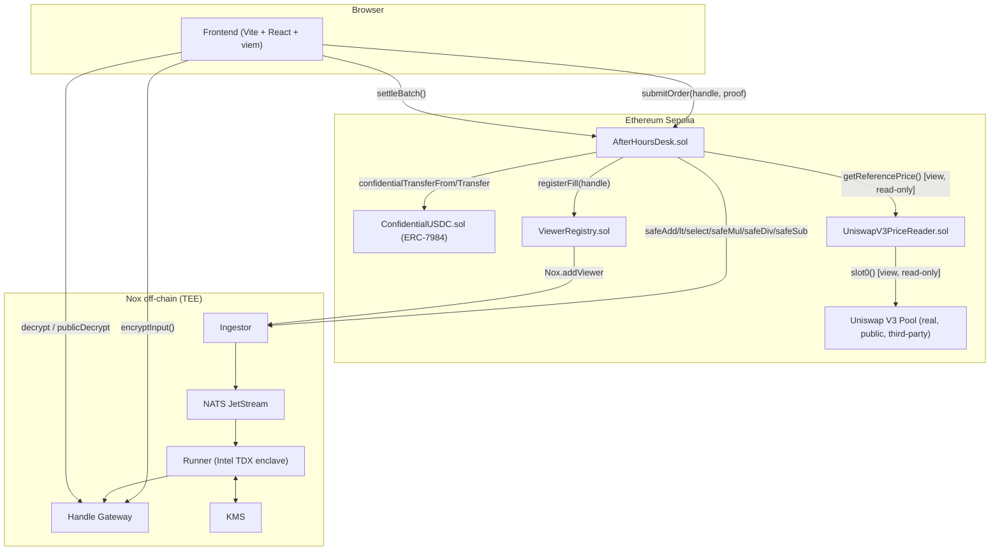
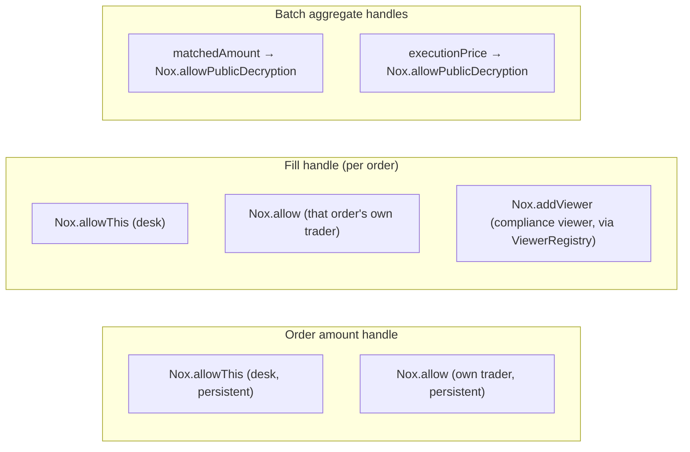

# Architecture

## System overview

Order size never exists as plaintext anywhere in this diagram except transiently, inside the
Runner's enclave memory. The chain only ever holds opaque 32-byte handles.

:::note One handle, followed everywhere
Trace any encrypted value through the diagram above and it stays a handle at every on-chain hop —
`submitOrder`, the primitive events, `confidentialTransfer`, `registerFill`. Plaintext only appears
inside the dashed "Nox off-chain (TEE)" box, and only while the Runner is computing.
:::

## Contracts

### `AfterHoursDesk.sol` — the settlement core

`submitOrder(bool isBuy, externalEuint256 amountHandle, bytes calldata amountProof)` validates the
caller's encrypted-input proof (`Nox.fromExternal` — Pattern A: the plaintext amount was encrypted
client-side *before* this call, so it never appears in calldata) and enqueues the order into the
currently open batch.

`settleBatch()` is callable by **anyone** — there is no privileged keeper, which matters: a
settlement function gated behind an operator role would be a centralization point a real dark pool
can't have. It nets the batch entirely from composed Nox primitives:

1. **Sum each side** — chained `Nox.safeAdd`, `select`-guarded against overflow at every step
   (never the bare wrapping `add` — an overflow must fall back to a defined prior value, never
   silently corrupt balance-critical state).
2. **Match** — `matched = select(lt(buySum, sellSum), buySum, sellSum)` — `select` is the *only*
   way to branch on encrypted data; there is no `if` on an `euint256`.
3. **Pro-rata fill per order** — `safeMul`/`safeDiv`/`safeSub`, each `select`-guarded, computing
   `fill = orderAmount × matched ÷ sideSum` and `residual = orderAmount − fill`.
4. **Real balance movement** — buy-side fills are pulled via `ConfidentialUSDC.confidentialTransferFrom`
   (the buyer must have pre-authorized the desk as a cUSDC operator — see below); sell-side fills
   are pushed via `confidentialTransfer`. This is real, on-chain confidential balance movement, not
   bookkeeping in a mapping that never touches the token contract. Like every Nox token primitive,
   these calls never revert on an insufficient balance — instead of throwing (which would leak
   "this trader can't cover the fill" to anyone watching the mempool via a revert oracle), a
   shortfall silently moves less than requested. This is *why* shortfall reconciliation is a
   documented [Roadmap](/docs/project/roadmap) item rather than something patched over with a `require`.
5. **Selective disclosure** — only the aggregate `matched` quantity and the execution price
   (read live from `UniswapV3PriceReader`) are ever marked `Nox.allowPublicDecryption`. Every
   per-order/per-fill handle stays behind `Nox.allow`/`Nox.addViewer`, scoped to that specific
   trader (and the auditor, via `ViewerRegistry`) — never public.

:::danger Settlement math never wraps silently
The bare `add`/`sub`/`mul`/`div` primitives wrap on overflow with no revert — Solidity `unchecked`
semantics. That is the wrong default for balance-critical netting, so every step above uses the
`safe*` variant and feeds its `success` flag into `select()` to fall back to a known-good value.
:::

**Why `safe*`, never the wrapping primitives, for any of this math:** Nox's plain
`add`/`sub`/`mul`/`div` wrap silently on overflow/underflow — never revert, the same semantics as
Solidity's `unchecked` block. That's a legitimate choice for logic bounded elsewhere, but it's the
wrong default for settlement math: a wrapped overflow while summing `buySum`/`sellSum` would
silently produce a wildly wrong `matched` quantity with no error signal anywhere on-chain. Every
step above therefore uses the `safeAdd`/`safeSub`/`safeMul`/`safeDiv` variant, each of which returns
`(ebool success, euint256 result)` instead of just a result — and that `success` flag feeds directly
into `Nox.select()` to fall back to the prior, known-good value on failure. An overflow can't
silently corrupt the batch, and the failure never surfaces as a revert an outside observer could use
to infer anything about the encrypted operands that caused it.

A genuinely non-obvious integration detail, confirmed by reading `ERC7984Base`'s actual source (not
assumed): calling `confidentialTransferFrom`/`confidentialTransfer` with a handle *this* contract
just computed is not automatically enough — the token contract's own internal `Nox.transfer` call
runs with the **token contract**, not the desk, as `msg.sender` from NoxCompute's perspective. The
desk must explicitly grant the token contract *transient* access
(`Nox.allowTransient(fill, address(settlementToken))`) immediately before calling, or the deeper
call reverts with `NotAllowed`. The same cross-contract ACL hand-off is needed a second time, for
`ViewerRegistry.registerFill`. See [Nox Integration](/docs/how-it-works/nox-integration) for the full story.

### `ConfidentialUSDC.sol` (cUSDC) — the confidential token

An ERC-7984 wrapper (`ERC20ToERC7984Wrapper` from `@iexec-nox/nox-confidential-contracts`) around
`MockUSDC.sol` — a plain, disclosed test ERC-20 deployed for this project rather than depending on
a third-party Sepolia test-USDC (those addresses/faucets are unreliable across sources and can go
dark without notice — exactly the kind of risk a hackathon demo can't afford). `wrap`/`unwrap` move
value 1:1 between the plaintext ERC-20 and the confidential balance; `confidentialTransfer(From)`
moves confidential balances directly. Traders authorize the desk as an **operator** — not an
allowance — with a deliberately short-lived window (15 minutes in this build), never a standing
grant. This distinction is load-bearing, not stylistic: ERC-7984's
`setOperator(address, uint48 validUntilTimestamp)` grants the operator full transfer rights over the
holder's *entire* confidential balance until that timestamp — there's no per-amount cap the way a
plaintext ERC-20 `approve` has. A long-lived or unscoped operator grant on a confidential balance
would be a real standing risk, not a convenience, so the window here is set tight (15 minutes) right
before it's needed and left to expire on its own rather than explicitly revoked.

### `ViewerRegistry.sol` — the compliance-viewer (auditor) module

Deliberately a standalone contract, not inlined into the desk, so the entire "who besides each
trader can decrypt a fill" surface is auditable in one small file. `complianceViewer` is set once,
at deploy time, and is `immutable` — Nox viewer/admin ACL grants are irrevocable on-chain, so a
"rotate the auditor" feature would only ever add access for new fills, never actually revoke access
to past ones; rather than half-build that, it's documented as a known, deliberate limitation. The
only documented way to approximate revocation is migrating to a **fresh handle** —
`Nox.add(oldHandle, Nox.toEuint256(0))` produces a new handle carrying the same value but a clean
ACL, and the contract repoints its storage to it — but the *old* handle's ciphertext still exists,
and anyone who was already a viewer on it can still decrypt that old value forever. This is an
application-level isolation, not a cryptographic revoke, which is precisely why a real rotation
feature belongs on the [Roadmap](/docs/project/roadmap) rather than being half-built here.
`registerFill` grants the compliance viewer `Nox.addViewer` (viewer role — decrypt-only) over a
fill, gated both by Nox's own ACL (the caller must already hold real access to the handle) and, as
defense-in-depth added after an internal review, a one-time-set `desk` address so only the paired
`AfterHoursDesk` can call it at all.

### `UniswapV3PriceReader.sol` — the composability layer

A minimal, `view`-only adapter reading `slot0()` from a real, live, third-party Uniswap V3 pool
(WETH/USDC, 0.05% fee tier) on Sepolia — confirmed to hold genuine liquidity (~3M USDC / ~147 WETH
at time of writing), not an abandoned/dust pool. Uses spot price, not a TWAP — a deliberate
tradeoff: this price is a disclosed *reference* value that never gates or moves real funds (unlike
using spot price to execute an actual swap or as loan-to-value collateral input), so single-block
manipulation risk is low-stakes here. The interface (`IUniswapV3PoolMinimal`) declares only
`slot0()/token0()/token1()` — no mutating Uniswap function is even reachable from this contract,
satisfying the hackathon's composability requirement literally: called, never modified.

:::warning Spot price, not TWAP — a disclosed tradeoff
The reader uses `slot0()` spot price, not a time-weighted average. That is deliberate for this build:
the price is a disclosed *reference* that never gates or moves real funds, so single-block
manipulation is low-stakes here. A production TWAP path is a documented
[Roadmap](/docs/project/roadmap) item.
:::

## The ACL model

The rule that holds everywhere in this codebase: **a handle's ACL is granted explicitly, before the
function that created it returns — never left implicit.** A freshly created handle starts
transient-only (this transaction, auto-expiring); anything that must survive past the current
transaction, or be decryptable by a specific account, gets an explicit grant. This is checked, not
assumed — `test/unit/ViewerRegistry.test.ts` proves with four genuinely distinct local accounts
(buyer, seller, auditor, a stranger with zero ACL over anything) that the compliance viewer
decrypts both fills, each trader decrypts only their own, and the stranger decrypts nothing at all.

## Frontend

Vite + React + TypeScript + viem — no wallet-connection library (wagmi/RainbowKit): the app's
wallet needs are narrow enough (one injected EIP-1193 provider, one required chain) that a
dedicated library would be pure bundle weight. Contract addresses and ABIs are never hand-copied:
`config/contracts.ts` imports `deployments/sepolia.json` (the repo's single source of truth for
deployed addresses) and the compiled Hardhat artifacts directly, so the frontend can never silently
drift from what's actually deployed.

Public reads (the tape, the Uniswap price strip) work with **no wallet connected at all** — a judge
opening the link should see real, live data immediately, not a connect-wallet wall. Only
write-requiring actions (submitting an order, settling, the auditor panel) gate on a connected
wallet. See [User Flows & UX](/docs/using-it/user-flows) for the actual screens.
