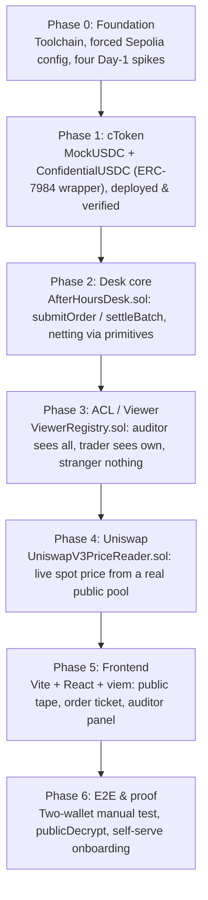
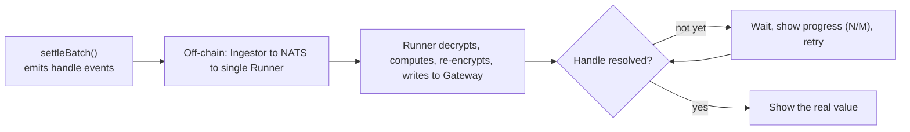

# Feedback Summary

`feedback.md` is not an afterthought. It is a **required, scored deliverable of the iExec WTF
Hackathon (Summer Edition)** worth real points in the rubric: the judges want to see, honestly,
where a brand-new confidential-computing stack helped, where it fought back, and what was decided
because of it. So the file is exactly that: a genuine, dated log of every piece of friction, every
surprise, and every design decision forced by Nox/iExec across the entire build, written
**incrementally as each phase happened**, never reconstructed at the end. It runs top to bottom,
Phase 0 through Phase 6, in the order the product was actually built.

> [!TIP]
> **Read the full log**
>
> This page is a **simplified summary** of the highest-signal moments only. The complete, unabridged,
> dated log lives in the repo. You can read the full log here:
> [**`feedback.md` on GitHub**](https://github.com/ceciliagalvaoo/after-hours-desk/blob/master/feedback.md).

Everything below is a plain-language distillation, not the full record. Where the log spends
paragraphs proving a claim against real source code and real transactions, this page keeps the
takeaway and points you back to the file for the receipts.

## The build, phase by phase

**Flowchart 1: The six build phases and what each one delivered**

*Source: The authors (2026).*

## Phase 0: the four Day-1 spikes

Before writing a single production contract, four unknowns were resolved against real source code
and a real local Nox stack, not against memory or docs alone.

### Netting is composed from primitives, not custom math

The dark pool needs to net a batch: sum the buy side, sum the sell side, match the minimum, and
compute residuals. Nox has **no "custom confidential function"** today (it is on their roadmap), so
this had to be expressed purely by chaining the primitives that already exist. A throwaway contract
proved it works: `safeAdd` (each side) → `lt` + `select` (matched = the smaller side) → `safeSub`
(residuals). This is **Plan A**, and it was tested end to end, not assumed. The plaintext order size
never leaves the enclave; the math happens over encrypted handles. Commit-reveal (Plan B) stayed
documented only as a fallback.

### Sepolia must be configured explicitly, never auto-detected

The public docs still warn that the SDK auto-resolves to **Arbitrum** Sepolia and that Ethereum
Sepolia support is "upcoming." Reading the actual installed SDK showed Ethereum Sepolia
(chainId 11155111) is already hardcoded and working. Even so, iExec's own reference PoC targets
Arbitrum, and the behavior could regress in a future beta, so the rule is: **never trust
auto-detection.** Every client is created with an explicit gateway URL, contract address, and
subgraph URL, plus a `chainId === 11155111` assertion up front.

### Only five encrypted types actually work at runtime

The docs list many "supported" encrypted types (including `address` and `bytes`) and even show a code
example using `address` right above a note saying it would throw. In reality, `encryptInput` accepts
only **`bool`, `uint16`, `uint256`, `int16`, `int256`** and throws a client-side error on anything
else. Consequence for the order ticket: the private amount is a `uint256`, the buy/sell side is a
`bool`; counterparty and order id stay in the clear as ordinary parameters.

### One Runner means everything is async, so decrypts must retry

Nox currently runs a **single Runner**, and the whole compute flow is asynchronous by design: a
primitive only emits an on-chain event; an off-chain pipeline then decrypts, computes, re-encrypts,
and writes the result back. Nothing resolves inside the same transaction. A warm chain of six
primitives took ~4 seconds end to end in testing, and latency grows with batch size. The lasting
decision: the UI must treat `settleBatch()` as **fire-and-forget followed by a loading state with
poll/retry**, never as a synchronous confirmation.

## Phase 1: the confidential token

### `ERC20ToERC7984Wrapper` is real, and hides even its total supply

`ConfidentialUSDC` (cUSDC) is a thin shell over `ERC20ToERC7984Wrapper` from
`@iexec-nox/nox-confidential-contracts`, confirmed by reading the installed source rather than
trusting the package name at face value. `wrap` takes a plaintext amount (the underlying ERC-20 is public
anyway); `unwrap` never does. A non-obvious property, kept on purpose: the wrapper's
`confidentialTotalSupply()` is decryptable by **no one**, not the deployer, not the public, because
the base only grants the contract itself internal access. For a dark pool, hiding even aggregate
volume is a feature, so it was documented rather than "fixed."

## Phase 2: the settlement core

### viem's `.simulate` silently ignores the bound wallet

Multi-account tests kept failing with `"Owner mismatch"` even though the encrypted proof was correct
byte for byte. The cause was viem, not Nox: a contract's `.write.*` uses the bound wallet client, but
`.simulate.*` runs the call as the **public client's default account** and does not fall back to the
bound wallet. So a seller-bound instance simulated as the buyer, and `Nox.fromExternal` saw the wrong
`msg.sender`. The fix: every `.simulate.<fn>()` on a non-default account must explicitly pass
`{ account: wallet.account }`.

## Phase 3: the auditor's access control

### Least privilege, proven with four distinct accounts

`ViewerRegistry.sol` isolates the compliance-viewer (auditor) ACL into one small, auditable contract.
The proof is a unit test with four genuinely distinct local accounts: the **auditor decrypts every
fill**, each **trader decrypts only their own** fill and is rejected on the other's, and a
**stranger decrypts nothing at all**. The auditor is granted the narrow `addViewer` (decrypt-only)
role, not admin, and, because Nox viewer grants are irrevocable on-chain, the auditor is set once,
`immutable`, rather than shipping a rotation feature that could not truly revoke past access.

### The fill was computed and then thrown away

Re-reading Phase 2 revealed a real gap: `_computeFill` correctly computed each order's `fill` handle
and even granted the trader ACL over it, but the handle was a local variable, never stored and never
exposed by any getter. So the product promised "each counterparty can decrypt their own fill," yet
after settlement **no one could actually reach the handle to decrypt it.** Fixed by persisting a
`fill` field on the order and exposing `getOrderFillHandle()`.

## Phase 4: real Uniswap composability

### Spot price, not TWAP: a disclosed tradeoff

The reader pulls the execution price from a **real, live, third-party Uniswap V3 pool** (WETH/USDC,
verified to hold genuine liquidity) on Sepolia. A true TWAP was confirmed technically viable on that
pool, but reconstructing it needs Uniswap's `TickMath`, which is pinned to `pragma solidity <0.8.0`
and would force a second compiler version into the project just for one read-only helper. Since this
price is a **disclosed reference value that never moves real funds** (settlement nets cUSDC 1:1,
decoupled from the price), single-block manipulation is low-stakes here, so spot was the honest
choice. A production TWAP path is a documented roadmap item.

### `Nox.toEuint256` always yields a public handle

Turning a plain `uint256` into an encrypted handle via `Nox.toEuint256` **always** produces a
"public" handle, and calling `allowPublicDecryption` on an already-public handle reverts. This was
already worked around for the placeholder price by first routing through `Nox.add(price, 0)`, and it
was confirmed that the same pattern is still needed once the price comes live from a real oracle call.
No surprise, just an explicit confirmation the pattern generalizes.

### `setDesk` is one-time-use, so every desk change forces a second redeploy

`ViewerRegistry.setDesk()` can be called only once (it reverts `DeskAlreadySet` afterward). That is a
deliberate Phase 3 hardening, but it has a real recurring cost: **every time the desk's bytecode or
constructor changes, a fresh `ViewerRegistry` must be deployed alongside it**, since the old one is
permanently paired to the old desk. The `UniswapV3PriceReader`, by contrast, is stateless and can be
reused across redeploys forever. The deploy script now checks `viewerRegistry.desk()` up front and
fails loudly instead of letting a confusing `OnlyDesk` revert appear later during settlement.

## Phase 5: the frontend

### The public RPC caps `eth_getLogs` at 50,000 blocks

With no subgraph of its own, the tape reconstructs history from raw events. A single full-range
`eth_getLogs` returns `exceed maximum block range: 50000` against the public RPC, observed live, not
read from docs. The fix paginates backward in 45,000-block windows down to a bounded floor. It is
documented in the file itself that a production build would use a real indexer, not a bigger constant.

### A deliberately short 15-minute operator window

Buying requires authorizing the desk as a cUSDC **operator**, and an ERC-7984 operator has **no
per-amount cap**: it can move the holder's entire confidential balance until the timestamp expires.
So the UI authorizes the desk for **15 minutes** from the click, never a far-future or "forever"
timestamp. Re-authorizing costs one extra transaction; leaving an indefinite window open because of a
UI shortcut was not acceptable.

### Retry on decrypt, so the demo never looks broken

A full `settleBatch()` chains ~10–12+ sequential async primitives per order, well beyond the SDK's
built-in ~6-second retry ceiling. A judge clicking "Decrypt" right after "MATCH FILLED" could
otherwise hit a timeout that reads as "broken" at the worst possible moment. `decryptWithRetry`
raises the effective ceiling to ~45 seconds and surfaces real progress ("Computing off-chain…
(N/M)") at all three decrypt points. In the real two-wallet test, decrypts actually resolved in ~5
seconds: the wide window is safety margin, not the expected wait.

**Flowchart 2: Why every decrypt is fire-and-forget with retry**

*Source: The authors (2026).*

## Read the full record

This page keeps only the highlights. The complete, dated, phase-by-phase log, with every source
consulted, every transaction hash, and every decision's full reasoning, is in
[**`feedback.md` on GitHub**](https://github.com/ceciliagalvaoo/after-hours-desk/blob/master/feedback.md).
